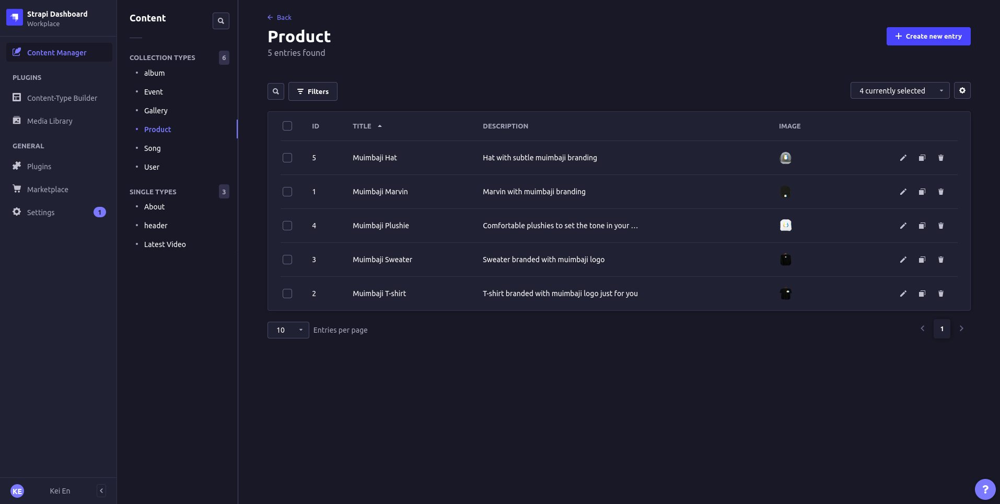
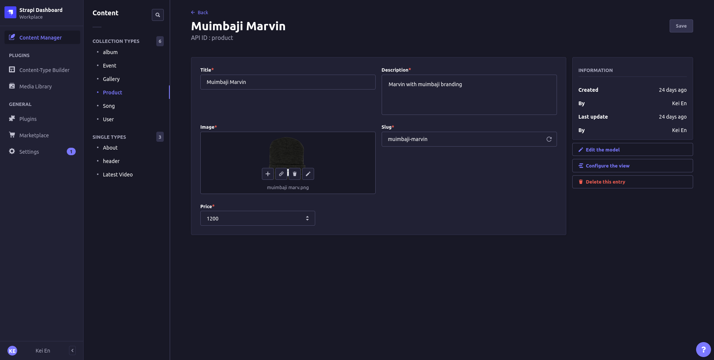
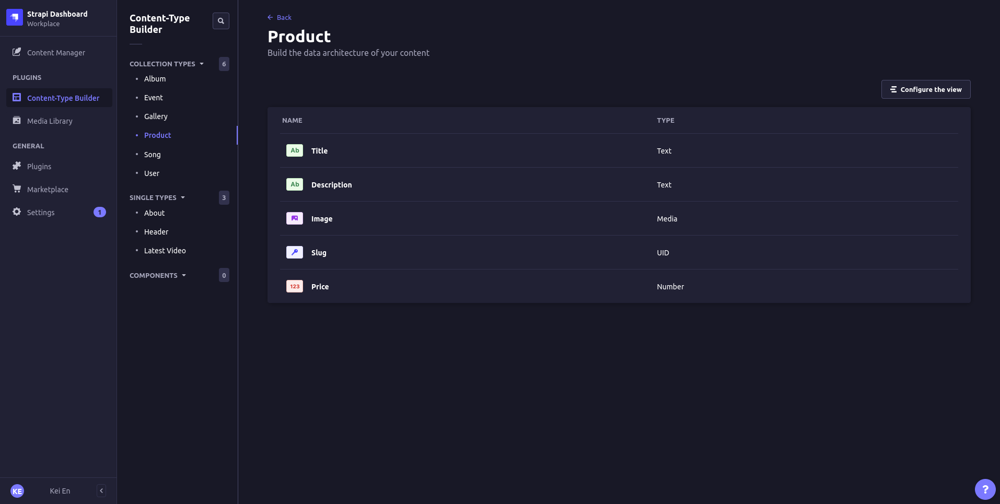

# Backend

This submodule is dedicated to the shop functionality of the Muimbaji eShop web application. It is built using Strapi CMS and facilitates the management of products, enabling operations such as adding, editing, and deleting products. The backend utilizes a PostgreSQL database to store data and is seamlessly connected to the Cloudinary service for media storage and optimization.

<div align="center">
    
    
    
</div>

## Installation

Navigate to _backend_ directory: `cd store-backend`,

Install project dependencies: `npm install`

## Usage

### `develop`

Start your Strapi application with autoReload enabled. [Learn more](https://docs.strapi.io/developer-docs/latest/developer-resources/cli/CLI.html#strapi-develop)

```
npm run develop
```

### `start`

Start your Strapi application with autoReload disabled. [Learn more](https://docs.strapi.io/developer-docs/latest/developer-resources/cli/CLI.html#strapi-start)

```
npm run start
```

### `build`

Build your admin panel. [Learn more](https://docs.strapi.io/developer-docs/latest/developer-resources/cli/CLI.html#strapi-build)

```
npm run build
```

## Deployment

Strapi gives you many possible deployment options for your project. Find the one that suits you on the [deployment section of the documentation](https://docs.strapi.io/developer-docs/latest/setup-deployment-guides/deployment.html).

## Learn more

- [Resource center](https://strapi.io/resource-center) - Strapi resource center.
- [Strapi documentation](https://docs.strapi.io) - Official Strapi documentation.
- [Strapi tutorials](https://strapi.io/tutorials) - List of tutorials made by the core team and the community.
- [Strapi blog](https://docs.strapi.io) - Official Strapi blog containing articles made by the Strapi team and the community.
- [Changelog](https://strapi.io/changelog) - Find out about the Strapi product updates, new features and general improvements.

Feel free to check out the [Strapi GitHub repository](https://github.com/strapi/strapi). Your feedback and contributions are welcome!

## Related Projects

- [frontend](../frontend/): Contains frontend logic that consumes data from this project

## Author

- **Karanja J Njuguna** - <[kei-en](https://github.com/kei-en)>
